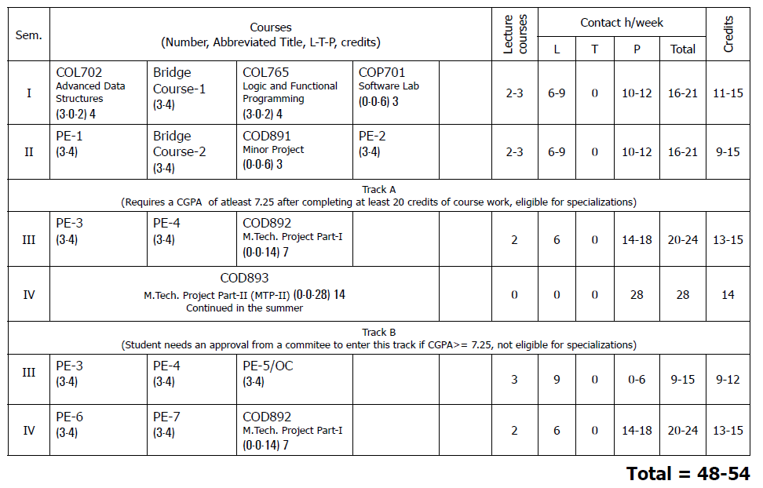

# IITD_PG_FAQs
## Welcome to IIT Delhi!
Hello! I'm [S U Swakath](https://www.linkedin.com/in/swakath-umamakeshwaran-57b2a717b?lipi=urn%3Ali%3Apage%3Ad_flagship3_profile_view_base_contact_details%3BceBgM1LuTQqpY2hsAvvp6g%3D%3D), currently in my second year of M.Tech in CSE at IIT Delhi. I've compiled this document to address common queries I've received from postgraduate students who will be joining IIT Delhi for the academic year 2024-25.

## Disclaimer
The information on this page is based on my past experiences at IIT Delhi and aims to address some common questions. It does not represent official IIT Delhi policies. For all official announcements regarding PG admissions, please visit https://home.iitd.ac.in/pg-admissions.php.

## Accommodation and Food
There is a hostel crisis at IIT Delhi, and postgraduate students will not get a hostel in the first semester. However, the administration exempts female students, students with special needs, and foreign nationals from this rule. All female students in our batch received hostel accommodation in the first semester.

### Localities
Most of the students who did not get a hostel on campus opted for Paying Guest (PG) accommodations in residential clusters around the IIT Delhi campus, such as  [Jia Sarai](https://maps.app.goo.gl/fZ6Z5KApnVkt8Gqw6), [Katwaria Sarai](https://maps.app.goo.gl/KEBvNBBpBwvKcHMR8) and [Ber Sarai](https://maps.app.goo.gl/q8JWcQ2h5gU1D7iL6). These areas are crowded, and the overall hygiene factor is slightly below average. In short, they are not dreamlands, and one needs to compromise to stay here.

Jia Sarai and Katwaria Sarai share a gate with the IIT campus, with most important buildings on the campus within a 15-minute walk from these localities. Entry through these gates is allowed between 5 AM and 11:59 PM, but exit is allowed 24/7. Most residents here are IIT students. These are the most suitable locations if **accessibility is your priority**. Ber Sarai, on the other hand, is slightly farther from the IIT campus, requiring a 15-minute cycle ride to commute. It is slightly less congested than the other two localities.

A few students opted for rooms in a locality called [Munirka](https://maps.app.goo.gl/R5GarUDLBJ9jo7ok6). It is farther, more congested, and many residents are not students. Therefore, I always recommend Jia Sarai and Ber Sarai over this place.

There are many more options, such as renting a flat with friends (at least 6-7 km away), which many PhD students do. However, I have listed only the most commonly used options by Master's students.

### Rooms
In these areas, you'll find a wide range of Paying Guests (PG) accommodations offering various amenities, such as AC/Non-AC rooms, independent or shared living spaces, with or without meal options. Many of us opted for double sharing or independent rooms. On average, the monthly rent for an AC room ranges from ₹12,000 to ₹14,000, while a Non-AC room typically costs ₹10,000 to ₹12,000, with additional charges for electricity and meals. In a double sharing arrangement, the rent and electricity expenses are usually split evenly. Electricity is priced at ₹9 per unit, with AC rooms averaging ₹2000-4000 in monthly electricity costs, and Non-AC rooms around ₹1000. So, to summarize, living in a double sharing AC room would amount to ₹7500-9000, whereas without AC, it would range between ₹6000-7000, inclusive of rent and electricity charges.

Most PG accommodations provide washing machines for residents' convenience. Furthermore, there are several laundry services accessible online and on-campus, charging approximately ₹65-80 per kilogram. Personally, I found [UClean's](https://www.uclean.in/) service to be reliable and convenient.

### Food
The majority of PG accommodations offer food services, typically charging around ₹150-200 per day for three meals. Alternatively, you can opt for the IIT mess subscription, which charges day scholars ₹250 per day for three meals. You have the flexibility to select any mess of your preference and can either purchase mess coupons or opt for a monthly mess card. From my experience, I always suggest choosing an IIT mess subscription over PG food. Despite being slightly more expensive, the food is extremely hygienic and offers a much wider variety of options compared to PG food. 

### Budget 
Based on the above discussions, I have constructed a table with a worst-case budget. Students will definitely spend less than this and can always make many cuts. So, consider this table with a pinch of salt—no need to panic.

|Service|Sharing Non-AC|Sharing AC|Independent Non-AC|
|---|----|---|---|
|Room|6000|8000|12000|
|Electricity|1000|2000|1000|
|Laundary|500|500|500|
|Food|7500|7500|7500|
|Total|15000|18000|21000|

### Hope
The hope is that you will get an old hostel within the campus by the end of January during your second semester. We all received campus accommodation by this time. The hostel allocation was done through a lottery system, and we got both double sharing and individual rooms. Getting an individual room proves your luck.

### Incampus accomodation cost
The [Board for Hostel Management](https://bhm.iitd.ac.in/) (BHM) at IIT Delhi is the main body that takes care of hostel-related matters. They have issued a circular regarding the hostel charges for Semester 1 of the academic year 2024-25. I am attaching the circular [here](https://bhm.iitd.ac.in/static/media/HostelCharges.fbefc5fe8aecfcb9890f.pdf); you can go through it for exact costs. For additional information regarding hostel policies, you can visit the [resources page](https://bhm.iitd.ac.in/resources) of BHM.

## Academics - M.Tech Computer Science and Engineering
IIT Delhi has a document called "[Courses of Study](https://home.iitd.ac.in/uploads/course-of-study/Courses%20of%20Study%202023-24.pdf)", which is considered the Bhagavad Gita when it comes to academic matters at IIT Delhi. I'm pretty sure that no living person has read this document completely. You go through this to understand the grading system, your program's curriculum, and course options in detail. This document gets updated every academic year, but the basic structure remains more or less similar.

I have filtered out the course curriculum of M.Tech CSE from the "Courses of Study" and attached it [here](documents/courses_of_study_MCS.pdf). The following table is from the same document. 

### Bridge Courses
Bridge courses are third-year bachelor's level courses. In MTech CSE, a student must clear 6 credits, which equals 2 bridge courses, as part of the credit requirement. There are four courses categorized as bridge courses:

1. COL632 - Introduction to Database Systems
2. COL633 - Resource Management in Computer Systems (OS)
3. COL671 - Artificial Intelligence
4. COL672 - Computer Networks

A student can clear bridge courses in two ways:

- **Waiver Exams:** Conducted during the first week of the semester, waiver exams allow students to bypass specific bridge courses if they pass. Participation is optional, and students can choose to take any number of exams. Each exam, overseen by a professor, may include subjective assessments or a viva component. Professors might also request proof of prior course completion during the student’s bachelor's degree. Passing these exams exempts students from taking the bridge course but does not award them credits or grades.

- **Regular Classes:** Students can fulfill the bridge course requirement by taking two bridge courses during their MTech. These courses are completed through regular classes, exams, and projects, attended alongside B.Tech CSE students. This method allows students to earn credits and grades, which will be reflected in their GPA.

Students who have already completed these courses in their bachelor's degree should aim to clear them via waiver exams to reduce their workload, allowing them to explore additional topics or have more leisure time. If a student fails the waiver exams, they can fulfill the requirement through regular classes.

For students who have not taken these courses during their bachelor's degree, especially those from different backgrounds like Electrical Engineering like me, it is recommended to follow the second method to gain essential fundamentals. COL632 and COL633 will be offered in the even semester, while COL671 and COL672 will be offered in the odd semester.

### Academic Tracks
After the second semester, students will have two academic tracks to choose from: Track-A, which is thesis-based, and Track-B, which is course-based. To choose Track-A, a student should have a minimum CGPA of 7.25; if the CGPA is lower, additional approvals are required. Most students prefer Track-A as it provides the opportunity to work under a professor on a long-term project.

Students who opt for Track-A typically find a guide by the end of the first semester in December and work with the professor for the next three semesters to fulfill their minor project, MTP-I, and MTP-II requirements.

**The department will designate a professor as the program coordinator. You can approach her with any academic requirement-related doubts. Detailed information about academic requirements will be provided during the orientation program, which takes place right after your admission.**

### Teaching Assistanceship
Master's students admitted through the Teaching Assistantship program will receive a stipend of ₹12,400 per month. They will be assigned to a course as a TA and are required to spend 8 hours per week assisting the professor in conducting the course. Responsibilities include conducting tutorials, lab sessions, invigilation, exam paper correction, and other related tasks. 

To continue receiving the assistantship, a student must maintain a minimum SGPA of 7.0 each semester. A satisfactory or unsatisfactory grade is awarded for TA work each semester, which will be reflected in the academic transcript. The CSE department also provides [TA Awards](https://www.cse.iitd.ac.in/index.php/2011-12-29-23-16-01/teaching-assistant-awards) at the end of each semester to TAs who have performed exceptionally well in their assigned courses.

### Tution Fees
The Academic Section at IIT Delhi has shared the Fee Circular for the 1st Semester of 2024-25 via an internal email. I am attaching the [circular here](documents/sem1_fee_2024_25.pdf), for your reference, which contains detailed information regarding tuition fees. 

## Contributions
For fellow IIT Delhi friends, please feel free to contribute to this write-up through pull requests. If you notice any inconsistencies in the information provided, please raise an issue or contact us via email at suswakath@gmail.com. Your input and collaboration are greatly appreciated in maintaining the accuracy and completeness of this document.